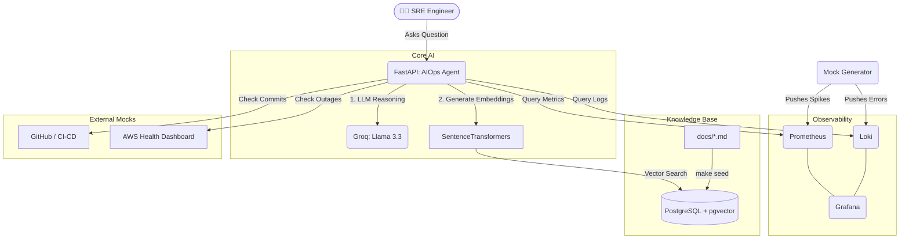

# Virtual SRE / AIOps Platform (LLMOps)

This repository implements a **Virtual Site Reliability Engineer (SRE)** and **AIOps Platform**. It connects an LLM agent (Llama 3.3 via Groq) directly to a simulated observability stack (Prometheus and Loki) and a local Vector Database (PostgreSQL with `pgvector`) containing SRE runbooks.

The agent diagnoses infrastructure anomalies dynamically by executing tools to inspect logs and metrics, correlating the issues with the internal knowledge base to suggest mitigations or apply fixes.

---

## 🏗️ Architecture & Component Stack

1. **AI SRE Agent (FastAPI)**: Serves as the brain, executing tool definitions (`query_prometheus_metrics`, `query_loki_logs`, `search_sre_manual`) and reasoning about incidents using Llama 3.3.
2. **Vector DB (PostgreSQL + pgvector)**: Stores vectorized SRE manuals and runbooks. Uses local `sentence-transformers` for embedding generation.
3. **Observability Stack**:
   - **Prometheus**: Collects resource metrics.
   - **Loki**: Stores application logs.
   - **Grafana**: Visualizes the incident with pre-configured dashboards.
4. **Mock Generator**: A background service (`mock_generator.py`) that continuously simulates a production crisis (OOMKilled events and CPU spikes) to feed Grafana and Loki.

### Architecture Diagram



---

## ⚡ Quick Start: Running the Simulation

Follow these steps to run the complete environment locally or on another machine.

### 1. Prerequisites
- Docker and Docker Compose installed.
- A **Groq API Key** (Get one for free at [console.groq.com](https://console.groq.com/)).

### 2. Configuration (`.env`)
Create a `.env` file in the root of the repository and add your Groq API Key:

```env
GROQ_API_KEY=gsk_your_groq_api_key_here
```
*(Note: `.env` is ignored by git to keep your credentials safe).*

### 3. Spin Up the Stack
Run the following command to build the containers and launch the services:

```bash
make up
```

This starts all services:
- FastAPI API: `http://localhost:8000`
- Grafana: `http://localhost:3000` (User/Password: `admin` / `admin`)
- Prometheus: `http://localhost:9090`
- Loki: `http://localhost:3100`

### 4. Feed the Vector Knowledge Base (Seeding)
Once the containers are running and healthy, seed the database with the SRE runbook:

```bash
make seed
```

---

## 🔬 How to Simulate the Incident & Test the Agent

The background `mock-generator` container continuously runs a 2-minute cycle simulating an incident:
- **Normal state**: CPU usage is low (20%), logs show typical heartbeat lines.
- **Crisis state**: CPU spikes to 98%, throwing `OOMKilled` errors in the logs.
- **Recovery state**: The new pod encounters startup probe delays while loading weights, triggering `startupProbe failed: connection refused` before returning to normal.

### Step 1: Open the Grafana Dashboard
Access **http://localhost:3000** (default credentials: `admin` / `admin`).
Open the **AIOps / SRE Incident Dashboard** to see the CPU spikes crossing the threshold in real time, and the container restart logs populated in the Loki log viewer.

### Step 2: Query the Virtual SRE Agent
Go to the FastAPI interactive docs at **http://localhost:8000/docs** or use `curl` to ask the agent:

```bash
curl -X POST "http://localhost:8000/ask" \
     -H "Content-Type: application/json" \
     -d '{"question": "Why did the FastAPI application become slow or unresponsive in the last few minutes? Check metrics and logs."}'
```

#### What happens under the hood?
1. The LLM receives the question and triggers `query_prometheus_metrics` and `query_loki_logs`.
2. It extracts the OOMKilled events and CPU metrics.
3. It triggers `search_sre_manual` to locate the runbook matching this scenario.
4. It compiles a complete, structured diagnosis mapping logs to the dashboard metrics and proposing mitigation steps.

---

## 📁 Repository Structure

- `app/main.py`: Main FastAPI application, system prompts, and tool handlers.
- `mock_generator.py`: Generates the CPU metrics and pushes log streams to Loki.
- `mock_runbook.txt`: The text file containing SRE instructions for vector DB ingestion.
- `grafana/`: Auto-provisioning configs for data sources and dashboards.
- `prometheus.yml`: Config file targeting the mock-generator exporter.
- `Dockerfile` & `docker-compose.yml`: Containerization and service orchestration.
- `Makefile`: Convenient commands for local development lifecycle.
